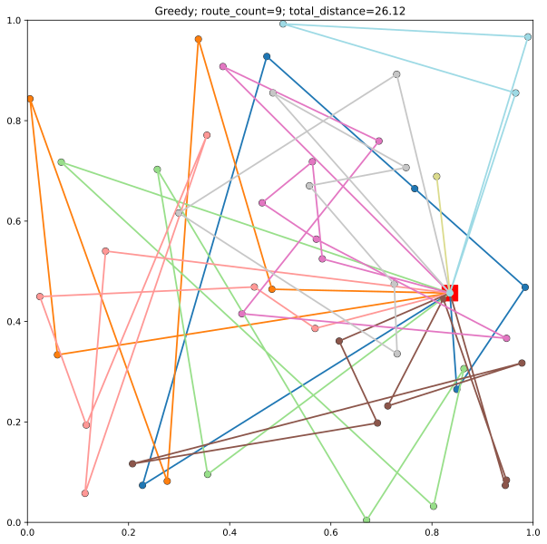

Bu agirlikli vrp problemini cozmek icin kullandigim bir gnn yaklasimli algoritmadir.
Projenin orijinali :https://id.elsevier.com/as/authorization.oauth2?platSite=SD%2Fscience&additionalPlatSites=GH%2Fgeneralhospital%2CLS%2FLS%2CMDY%2Fmendeley%2CSC%2Fscopus%2CRX%2Freaxys&scope=openid%20email%20profile%20els_auth_info%20els_idp_info%20els_idp_analytics_attrs%20urn%3Acom%3Aelsevier%3Aidp%3Apolicy%3Aproduct%3Ainst_assoc&response_type=code&redirect_uri=https%3A%2F%2Fwww.sciencedirect.com%2Fuser%2Fidentity%2Flanding&authType=SINGLE_SIGN_IN&prompt=none&client_id=SDFE-v4&state=retryCounter%3D0%26csrfToken%3Dedba45cc-923c-43f8-8fcb-f6cde7fc6e23%26idpPolicy%3Durn%253Acom%253Aelsevier%253Aidp%253Apolicy%253Aproduct%253Ainst_assoc%26returnUrl%3D%252Fscience%252Farticle%252Fpii%252FS092523122200978X%26prompt%3Dnone%26cid%3Darp-ec4aef19-8aad-4ef4-a69d-175265ffc10e
Projenin orijinal reposu: https://github.com/Lei-Kun/DRL-and-graph-neural-network-for-routing-problems

